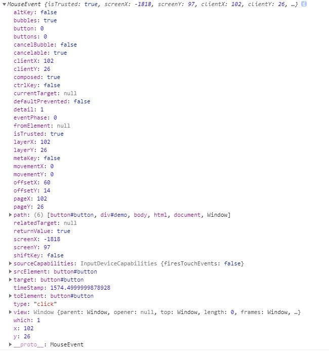

# 事件流

## 事件

事件是`HTML`和`Javascript`交互的驱动器, 事件是文档或者浏览器窗口中发生的，特定的交互瞬间。  
 事件是用户或浏览器自身执行的某种动作，如 `click`,`load` 和 `mouseover` 都是事件的名字。  
 事件是 `javaScript` 和 `DOM` 之间交互的桥梁。

## 事件流

事件流, 即是一个事件发生的流程或者说流转, 从开始到结束, 都发生了什么

## 阶段

事件流有三个阶段

- 捕获阶段 Capture Phase; 从上到下, 层层传递, 直到目标接收
- 目标阶段 Target Phase; 确认目标, 进行处理
- 冒泡阶段 Bubbling Phase; 处理结束, 往上传递.

详见下图一(图片来自 W3C):


## DEMO

> `addEventListener`方法中有参数可以控制是在冒泡阶段触发还是在捕获阶段触发. 详见:
> [EventTarget.addEventListener() - Web API 接口参考 | MDN](https://developer.mozilla.org/zh-CN/docs/Web/API/EventTarget/addEventListener)

**示例代码:**

```html
<div id="demo">
  DIV
  <button id="button">BUTTON</button>
</div>

<script>
  function $(selector) {
    return new jQuery(selector)
  }
  class jQuery {
    constructor(selector) {
      if (selector === document || selector === window) {
        this.el = selector
      } else {
        this.el = document.querySelector(selector)
      }
    }

    on(eventName, listener, options, useCapture) {
      this.el.addEventListener(eventName, listener, options, useCapture)
      return this
    }
  }

  // PS: 真实的jQuery比这个复杂, 而且this.el是个数组, 真实demo请看下面, 上面可以忽略

  ;[window, document, 'html', 'body', '#demo', '#button'].forEach((selector, index) => {
    // 注意: 实际代码中应把listener抽取出来不是放在forEach中, 这样做会导致生成六份listener, 占用六份的内存空间
    $(selector)
      .on('click', (event) => {
        console.log('冒泡', index, selector, event)
      })
      .on(
        'click',
        (event) => {
          console.log('捕获', index, selector, event)
        },
        true
      )
  })
</script>
```

[codepen 在线示例](https://codepen.io/wenyejie/pen/WNreKgj)

**当我点击了 BUTTON 之后**返回结果如下图二:


简单分一下 `0~4`为`捕获阶段`, `5~5`为`目标阶段`, `4~0`为`冒泡阶段`

> 注意: 对于事件目标上的事件监听器来说，事件会处于“目标阶段”，而不是冒泡阶段或者捕获阶段。在目标阶段
> 的事件会触发该元素（即事件目标）上的所有监听器，而不在乎这个监听器到底在注册时`useCapture` 参数值
> 是`true`还是`false`。 --
> [摘自 MDN](https://developer.mozilla.org/zh-CN/docs/Web/API/EventTarget/addEventListener)

详细点开看一下`MouseEvent`如下图三:

> PS: 图二中所有的 MouseEvent 都一样



从`MouseEvent`的`path`中可以看出, 所有的触发节点和它们的上下级关系

## 阻止冒泡

在事件中我们可以使用`event.stopPropagation()`来阻止事件冒泡, 当冒泡被阻止之后这个事件消
息`MouseEvent`就不会往上传递.

```javascript
;[window, document, 'html', 'body', '#demo', '#button'].forEach((selector, index) => {
  $(selector)
    .on('click', (event) => {
      if (selector === '#demo') {
        event.stopPropagation()
      }
      console.log('冒泡', index, selector, event)
    })
    .on(
      'click',
      (event) => {
        console.log('捕获', index, selector, event)
      },
      true
    )
})
```

结果: **捕获 0 -> 捕获 1 -> 捕获 2 -> 捕获 3 -> 捕获 4 -> 冒泡 5 -> 捕获 5 -> 冒泡 4**

阻止冒泡就是人为的, 中止了事件流的流转.

因为在`#demo`中被阻止了冒泡, 所以后续的流程不会发生`冒泡3 -> 冒泡2 -> 冒泡1 -> 冒泡0`被中止

因为绝大多数的事件都是使用冒泡`useCapture = false` 所以当冒泡被阻止的时候, 目标元素的父级的事件一般
不会发生

**什么时候需要用到呢?**

```html
<section>
  <header>
    <h3>title <button>close</button></h3>
    <h4>subtitle</h4>
  </header>
  <content>content</content>
</section>
```

当点击标题需要收起内容, 点击关闭按钮需要关闭`section`时.

即当**子级元素**的事件与**父级元素**的事件发生功能上的冲突的时候, 这个时候就需要阻止冒泡(但这不是唯
一的办法)

## 事件捕获

既然绝大多数的事件都是冒泡中被触发, 那么捕获中我们可以做什么, 它可以用来做什么?

**答**: 防止事件被阻止冒泡之后父级元素无法触发需要触发的事件, 比如一些日志上报

```javascript
$('[data-report]').on(
  'click',
  (event) => {
    report(event.target.dataset.report)
  },
  true
)
```

## 事件委托

因为`事件冒泡`和`事件捕获`是层层递进的, 不管哪个子级元素触发了事件, 父级元素都可以触发相对应的事件

基于以上的基础, 衍生了`事件委托`.

即目标元素本身不绑定事件, 而是把事件绑定在父级元素中, 在事件中进行判定是否为当前需要触发
的`目标元素`, 从而执行一些相应的操作.

```javascript
$('#demo').on('click', (event) => {
  // 你是#button嘛?
  if (event.target.id === 'button') {
    alert('it work.')
  }
})
```

> 注意: 从原理上来讲可以把所有事件委托到`document`中, 但并不建议这样做, 有个原则就是被委托的父级元素
> 在允许的情况下, 越接近目标元素越好, 要不然可能会有性能问题.

## 参考文档

- [EventTarget.addEventListener() - Web API 接口参考 | MDN](https://developer.mozilla.org/zh-CN/docs/Web/API/EventTarget/addEventListener)
