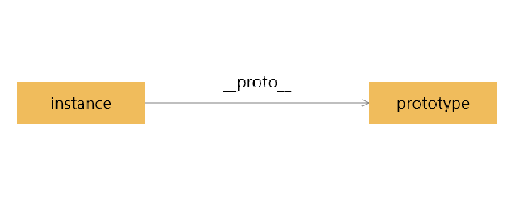
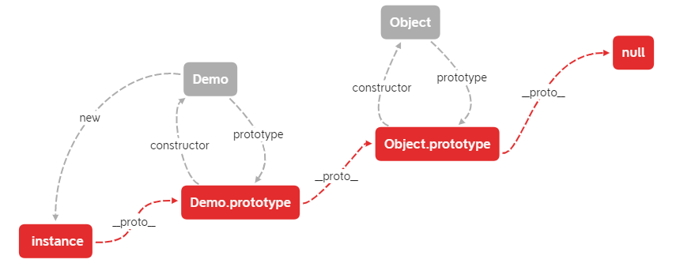

# 原型和原型链

> 原型和原型链是 Javascript 中经常被提及的概念, 涉及到继承与封装等, 基本上谈论 JS 都离不开原型和原型
> 链

## 原型(prototype)

> `原型`又称之为`原型对象`, 因为原型就是一个对象, 原型是函数默认的属性(除了箭头函数)

原型对象中的属性和方法又被称之为原型属性/方法可以通过`Demo.prototype.getName`访问

```javascript
class Demo {
  constructor() {}
  setName(name) {
    this.name = name
  }
  getName(name) {
    return this.name
  }
}

const instance = new Demo()

console.log(instance.__proto__ === Demo.prototype) // true
console.log(Demo.prototype) // 原型, 详见图一
```


## 原型链

> 每个对象被创建的时候都会通过`__proto__`的方式关联另一个对象, 这种关联与被关联的方式就叫做原型链

被创建的对象叫做实例, 被关联的对象是原型对象, 它们之间的关系就叫做原型链(当然只是其中的一部分). 如图
二



> 实例和原型对象都是对象

```javascript
const d = new Demo()

// 等于

const e = Object.create(Demo.prototype)
```

关于 `Object.create` 详见:
[Object.create() - JavaScript | MDN](https://developer.mozilla.org/zh-CN/docs/Web/JavaScript/Reference/Global_Objects/Object/create)

## 调用

```javascript
const instance = new Demo()
instance.name = 'demo'

instance.getName() // demo
```

以上为最简单的原型链的搜索访问. 实例本身没有`getName`方法, 但是实例的原型链所指向的原型对象中, 包含
有`getName`方法, 它就会调用该方法.

如果使用本身并且原型链中不存在的方法如: `instance.test()` 则会报错
`Uncaught TypeError: instance.test is not a function`, 如果是属性则会返回`undefined`

具体逻辑是:

1. 访问实例的`test`方法, **不存在**
2. 访问原型链`instance.__proto__`所指向的原型对象`Demo.prototype`中的`test`方法, **不存在**
3. 继续访问`Demo.prototype`上一层的原型链`Demo.prototype.__proto__`所指向的原型对
   象`Object.prototype`的`test`方法, **不存在**
4. 继续访问`Object.prototype`上一层的原型链`Object.prototype.__proto__`即`null`所指向的原型对象,
   `null` 不具有属性, 会报错

具体逻辑如下图三



> 途中红色部分即为原型链, 灰色部分为其它关系

`Demo`, `Object`为构造函数, instance 为实例对象, `Demo.prototype`和`Object.prototype`为原型对象

instance 继承了来自`Object.prototype`, `Demo.prototype`的方法/属性如:

```javascript
instance.getName() // 来自Demo.prototype
instance.toString() // 来自Object.prototype
```

因为这种继承关系是通过`__ptoto__`指向的, 所以即使`instance`生成后, 改
变`Demo.prototype`和`Object.prototype`, 依然会立即被`instance`继承如:

```javascript
Demo.prototype.sayHi = function() {}
Object.prototype.sayHello = function() {}

instance.sayHi() // it work.
instance.sayHello() // it work.
```

## 原型链的缺点

> 原型链中表现出来的继承关系非常好用, 但是也有缺点, 如果原型链太长, 查找起来会非常耗时, 效率很低, 毕
> 竟要一级一级往上查找, 所以这种继承关系不宜太长太复杂

注意使用 for...in 的时候需要注意, 有时候需要避免读取原型的属性, 详见:
[#仅迭代自身的属性 - for...in - JavaScript | MDN](https://developer.mozilla.org/zh-CN/docs/Web/JavaScript/Reference/Statements/for...in#%E4%BB%85%E8%BF%AD%E4%BB%A3%E8%87%AA%E8%BA%AB%E7%9A%84%E5%B1%9E%E6%80%A7)

## 改变原型链

> 类似于现实生活中的**过继**一样这种关系是可以变更的.

注: 改变原型链有两种方式, 直接变更`__proto__`指向, 通过`Object.setPrototypeOf`方法来改变, 推荐使用后
者

关于`Object.setPrototypeOf`详
见[Object.setPrototypeOf() - JavaScript | MDN](https://developer.mozilla.org/zh-CN/docs/Web/JavaScript/Reference/Global_Objects/Object/setPrototypeOf)

下面摘抄一段话:

> 警告: 由于现代 JavaScript 引擎优化属性访问所带来的特性的关系，更改对象的 [[Prototype]]在各个浏览器
> 和 JavaScript 引擎上都是一个很慢的操作。其在更改继承的性能上的影响是微妙而又广泛的，这不仅仅限于
> obj.**proto** = ... 语句上的时间花费，而且可能会延伸到任何代码，那些可以访问任何[[Prototype]]已被
> 更改的对象的代码。如果你关心性能，你应该避免设置一个对象的 [[Prototype]]。相反，你应该使用
> Object.create()来创建带有你想要的[[Prototype]]的新对象。

```javascript
const instance = new Demo()

// 实例一
instance.__proto__ = null
// 或
Object.setPrototypeOf(instance, null)

instance.getName() // Uncaught TypeError

// 实例二
Object.setPrototypeOf(instance, {
  coding() {
    console.log('coding......')
  }
})

instance.getName() // Uncaught TypeError
instance.coding() // it work.
```

## 补充

- 如果实例本身和原型对象中都拥有该属性和方法, 会优先使用自身所拥有的
- null 是所有原型链的最终点
- 如果你只是需要简单的 map 存放数据, 而不需要其它功能, 可以通过`Object.create(null)`来创
  建`null __proto__ object`

## 参考文档

- [MDN Web 文档](view-source:https://developer.mozilla.org/zh-CN/)
